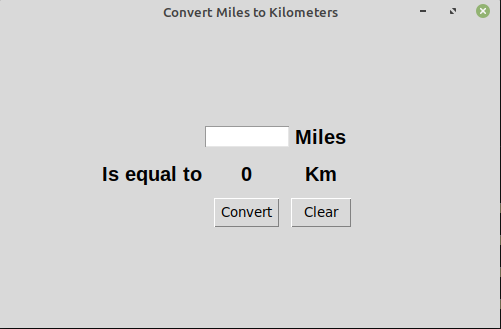
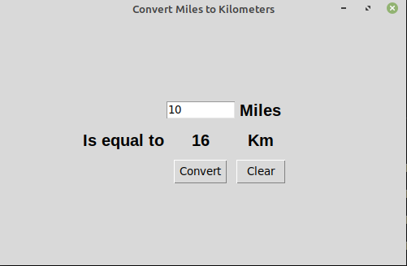

# Day27


## Lessons learned today

- tkinter
```
from tkinter import *

```
- Unlimited arguments
```
def add(*args):
    total = 0
    for n in args:
        total += n
    return total

add(1,2,3,4,5,6)
```

- Unlimited keyword arguments

```
class Car: 
    def __init__(self,**kwargs):
        self.model = kwargs.get('model')
        self.color = kwargs.get('color')

my_car = Car(model="Nisan")
```

## Project to solidify material learned: 

### Preview:




### Miles to kilometers convertor

> This application is built with python using the tkinter module... The application converts miles to kilometers

## How to run this on your device

- Clone this repository
```
git clone https://github.com/kingdreamerr/Day27_miles_to_kilos_Tkinter.git
```
- cd into the repo
```
cd Day27_miles_to_kilos_Tkinter
```

- Paste the following in the terminal 
```
python3 main.py
```